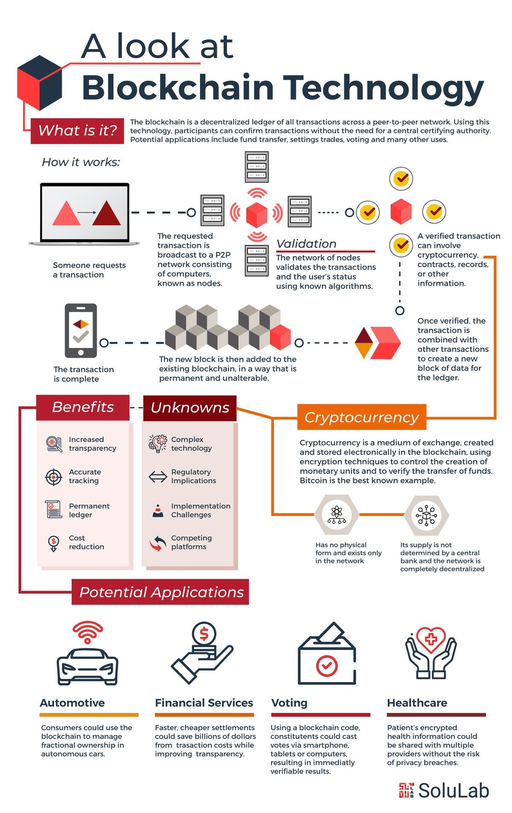
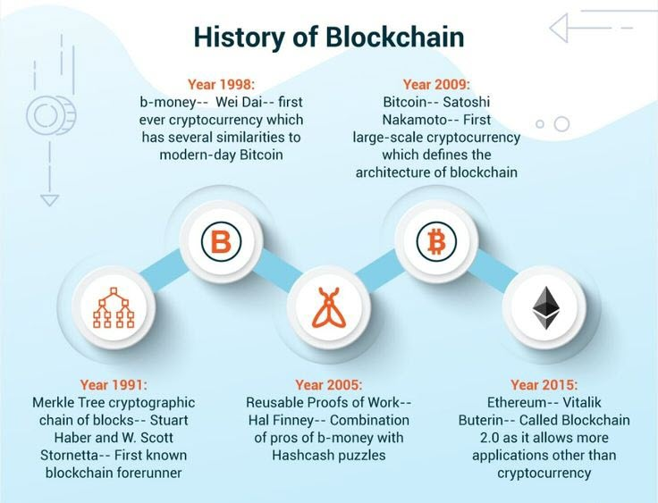
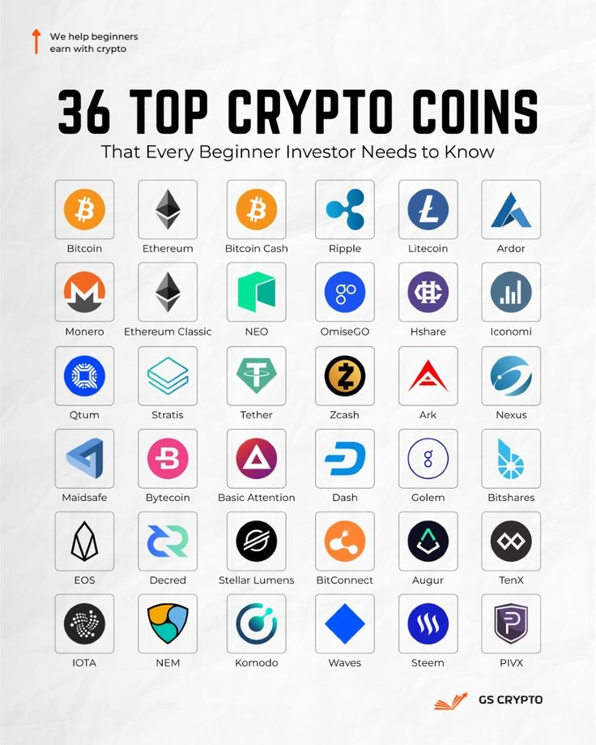
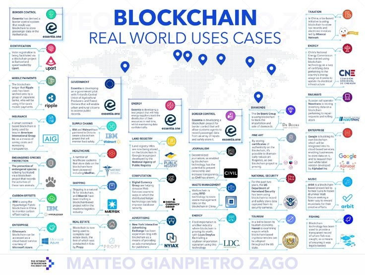
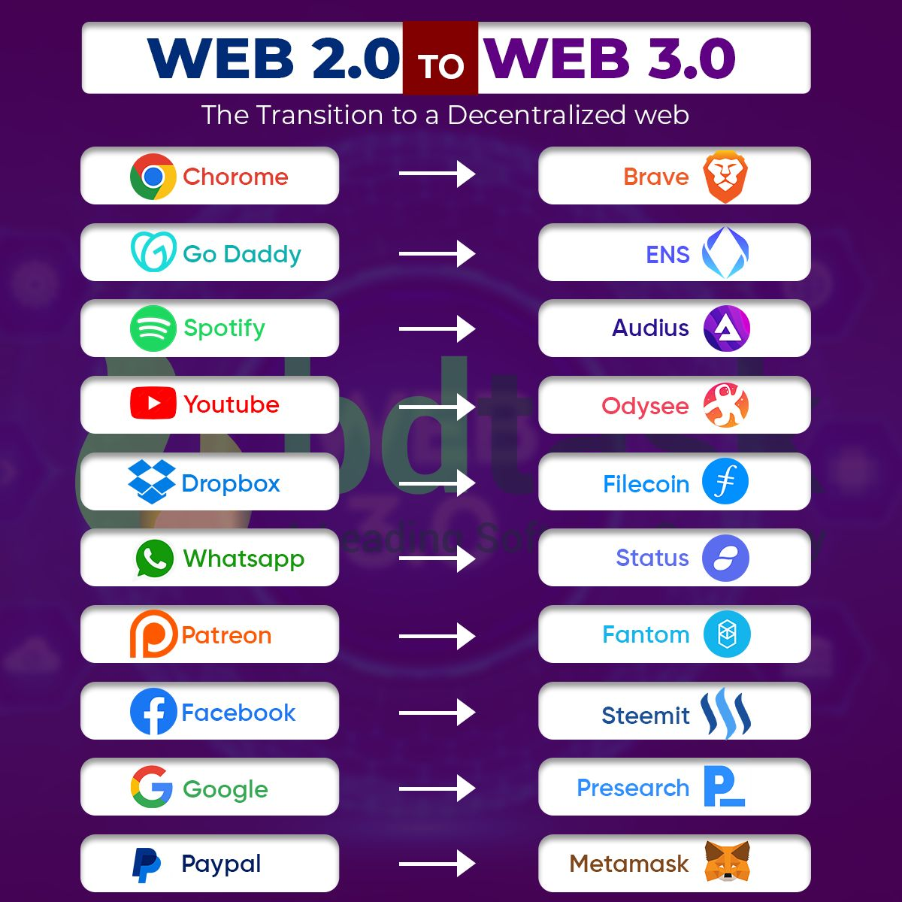

<style>
@import url('https://fonts.googleapis.com/css2?family=Prompt:ital,wght@0,100;0,300;0,400;0,700;1,100;1,300;1,400;1,700&display=swap');

    :root {
    font-family: Prompt;
    --hl-color: #D57E7E;
}
h1 {
  font-family: Prompt
}
</style>

# Workshop Technology

---

# Blockchain

---

# What is it?

> Blockchain is a public ledger that records transactions in a chain of blocks, and is a way to share information transparently within a network.

---



# How does it work?

[Source](https://www.pinterest.com/pin/729723945875868579/)

---



[Source](https://www.pinterest.com/pin/1005358316800182043/)

---

# Applications



---

# Applications



[Source](https://www.pinterest.com/pin/183662491038883051/)

---



---

# Blockchain

> Digital trust

---

# Task 1: Get your hands dirty

- Setup MetaMask
- Get some ETH!
  - https://cloud.google.com/application/web3/faucet/ethereum/sepolia
- Send others some eth.
- Add some LINK!
  - `0x779877A7B0D9E8603169DdbD7836e478b4624789`

---

# Task 2: Love letter

---

# Smart contract

- A smart contract is a computer program that automatically executes an agreement between two parties.
- Smart contracts are built on a blockchain.

---

# Write and deploy smart contract

- https://remix.ethereum.org/

---

# Love Letter

```js
// SPDX-License-Identifier: GPL-3.0

pragma solidity >=0.8.2 <0.9.0;

/**
 * @title LoveLetter
 * @dev Store love confession
 */
contract LoveLetter {

    string public secret;

    /**
     * @dev Initialize
     * @param _secret to initialize
     */
    constructor(string memory _secret) {
        secret = _secret;
    }

    /**
     * @dev Store value in variable
     * @param _secret to store
     */
    function changeSecret(string memory _secret) public {
        secret = _secret;
    }
}

```

---

# Task 3: Blockchain-powered application

---

# Steps

- [Code](https://github.com/inter-workshop-67/dapp)
- Make `.env` from `.env.example`
- Fill in information
- `pnpm install`
- `pnpm run dev`
- `pnpm run build`

---

# Deploy

https://pages.cloudflare.com/
