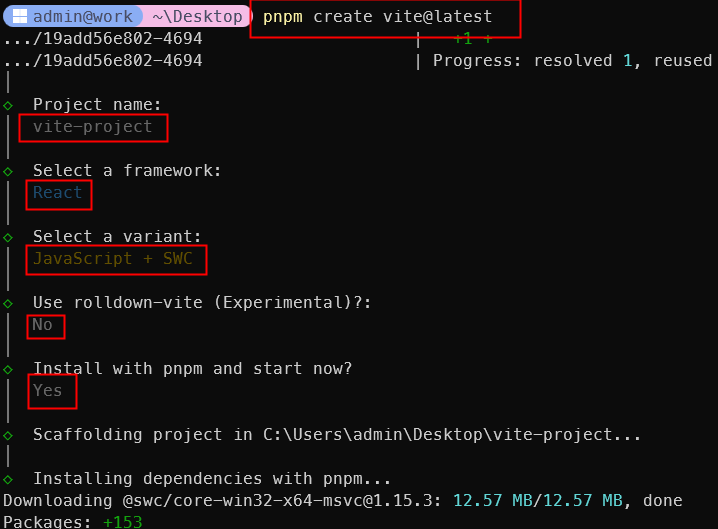
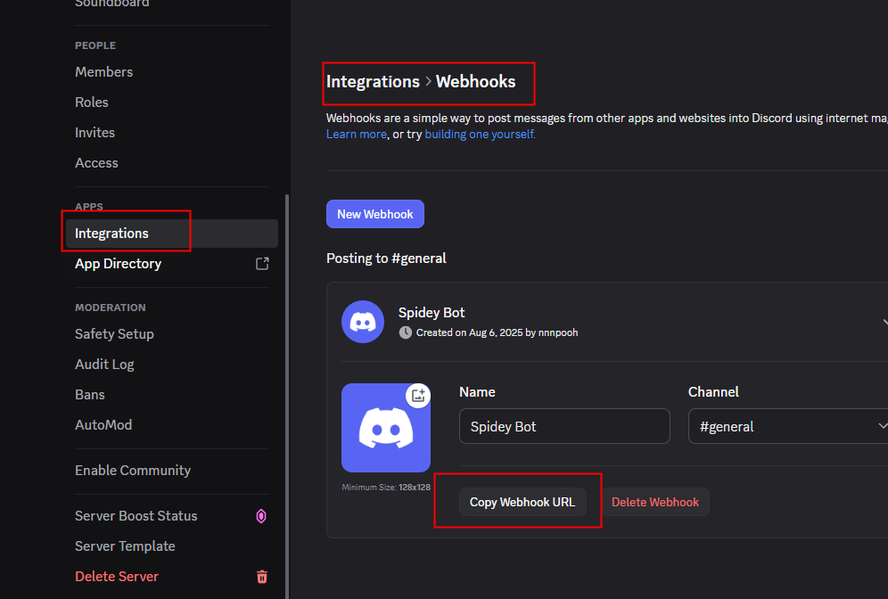

<style>
@import url('https://fonts.googleapis.com/css2?family=Prompt:ital,wght@0,100;0,300;0,400;0,700;1,100;1,300;1,400;1,700&display=swap');

    :root {
    font-family: Prompt;
    --hl-color: #D57E7E;
}
h1 {
  font-family: Prompt
}
</style>

# Workshop Technology

---

# JavaScript Frameworks

---

# What is a framework?

- A framework is a library that offers **opinions** about how software gets built.
- These opinions allow for **predictability** and **homogeneity** in an application.
  - Predictability allows software to scale to an enormous size and still be maintainable.
  - Predictability and maintainability are essential for the health and longevity of software.

---

# Vanilla JS or Framework?

- Vanilla JS
  - A less complex site, for example a personal to-do list or a site that displays mostly static content
- Framework
  - A large site with a complex UI. Frameworks provide solutions to common problems that would take an absurd amount of time and patience to implement with pure JavaScript.

---

# Stack-Overflow survey 2025

- Stack-Overflow is a popular Q&A website for programmers.
- Every year, they conduct a survey to gather insights about the developer community.
- Here are the [results](https://survey.stackoverflow.co/2025/technology/#1-web-frameworks-and-technologies).

---

# React

---

# Get started with `React` (1/2)

- Open CMD/Terminal
- `pnpm create vite@latest`
  - `Project name`: vite-project
  - `Select a framework`: React
  - `Select a variant`: JavaScript + SWC
  - `Use rolldown-vite...?`: No
  - `Install with pnpm...?`: Yes

---



---

# Visit Your New React App

- Open your browser and go to `http://localhost:5173/`

---

# Get started with `React` (2/2)

- Press `ctrl + c` to stop the development server.
  - Make sure you click on the terminal window first.
- Open VSCode
- Drag and drop the `vite-project` folder into VSCode
- In the terminal, run:
  - `pnpm run dev`

---

# Customization (1/2)

- Title

  - Change this line in `index.html`.

```html
<title>My very cool title</title>
```

---

# Customization (2/2)

- Favicon
  - https://www.favicongenerator.io/
  - Make favicon and download.
  - Extract `favicon.svg` into `public` folder
  - Change this line in `index.html`.

```html
<link rel="icon" type="image/svg+xml" href="/favicon.svg" />
```

---

# Reset

- Clear content in `src/index.css` and `src/app.css`
- Replace `src/App.jsx` with

```js
function App() {
  return <></>;
}

export default App;
```

---

# Styling

- Add the following line at the top of `src/App.jsx`

```js
import "./App.css";
```

- You can now type CSS in `src/App.css`

---

# Using CSS

`App.jsx`

```js
import "./App.css";
```

---

# CSS - Example 1

`App.css`

```css
body {
  font-family: Arial, Helvetica, sans-serif;
  margin: 1rem 1rem;
  background-color: #f5f5f5;
  color: #333333;
}

h1,
h2 {
  color: #2a5d8f;
}

img {
  border-radius: 8px;
}
```

---

# CSS - Example 2

`App.css`

```css
button {
  background-color: #2a5d8f;
  color: white;
  border: none;
  padding: 10px 20px;
  border-radius: 5px;
  cursor: pointer;
}

input {
  padding: 8px;
  border: 1px solid #ccc;
  border-radius: 4px;
  margin-right: 10px;
}
```

---

# State Management

```js
import { useState } from "react";

function App() {
  const [count, setCount] = useState(0);

  return (
    <>
      <h2>Count: {count}</h2>
      <button onClick={() => setCount(count + 1)}>Click me!</button>
    </>
  );
}
```

---

# Send Discord Message

---

# Get Discord Webhook URL

- Go to your Discord server.
- Go to `Server Settings` > `Integrations` > `Webhooks`.
- Create a new webhook and copy the webhook URL.

---



---

In `App` return statement

```jsx
<h2>Contact Me</h2>
<input type="text" id="message" />
<button onClick={sendWebhook}>Poke Me</button>
```

---

In `App` function body

```js
// Send discord webhook
function sendWebhook() {
  const webhookUrl = ""; // Replace with your webhook URL

  const message = document.getElementById("message").value || "Hello!";
  const corsProxy = "https://cors.iecmu.com";
  fetch(corsProxy + "/" + webhookUrl, {
    method: "POST",
    headers: {
      "Content-Type": "application/json",
    },
    body: JSON.stringify({
      content: message,
    }),
  });
}
```

---

# Build

- `pnpm run build`

# Preview

- `npm run preview`

---

# Deploy

- Deploy `./dist` folder to Netlify.

---

# Full Source Code

https://github.com/inter-workshop-68/react-app
